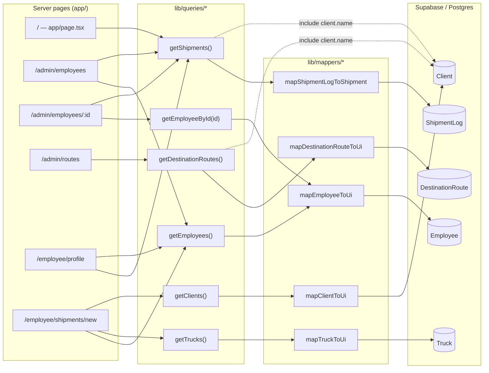
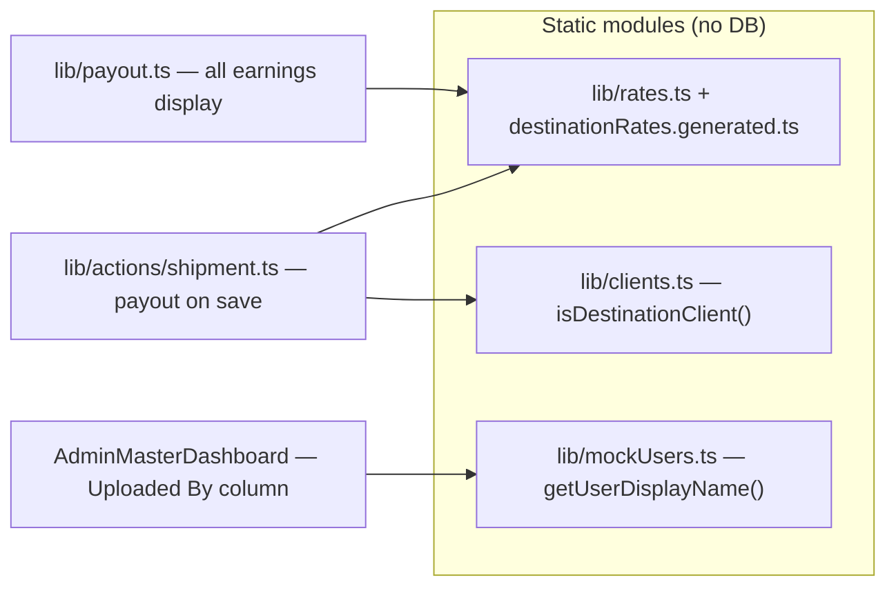
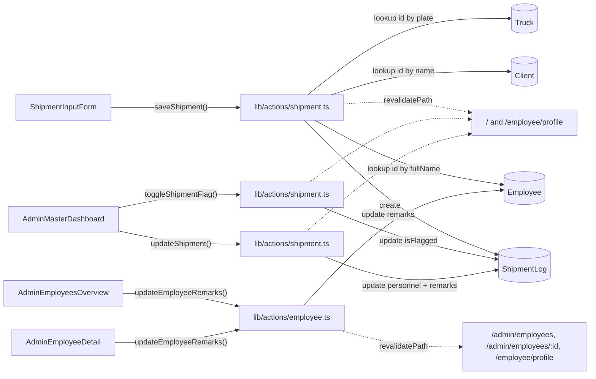
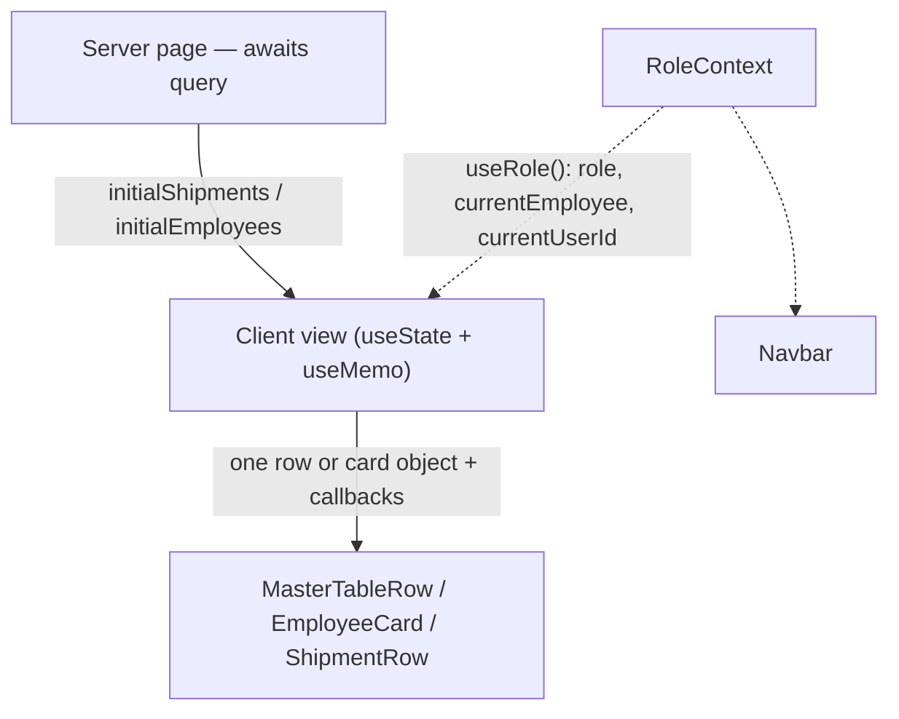

# Data Flow Map

Where each page gets its data, which table it comes from, and where nulls appear.

Regenerate this when `lib/queries/*`, `lib/actions/*`, or `prisma/schema.prisma` change.

---

## 1. Read path — page → query → mapper → table



`/admin/shipments` is a client-side redirect to `/`; it reads nothing.

Every DB-backed page sets `export const dynamic = "force-dynamic"`, so there is no caching
between requests — each page load re-runs its queries.

### Still read from static TypeScript, not the database



---

## 2. Write path — component → server action → table



**Note on refresh:** the two shipment actions revalidate `/` and `/employee/profile` but **not**
`/admin/employees` or `/admin/employees/[id]`, even though both pages call `getShipments()`.
Flagging a shipment therefore leaves the employee pages showing stale shipment data.

The dashboard also does not rely on revalidation for its own table — it patches the returned
`Shipment` into local `useState`, so the visible row updates immediately.

---

## 3. Where nulls come from and where they are erased

Nulls are collapsed at the **mapper boundary**. By the time data reaches a component, most
`String?` columns have become `""`.

### `ShipmentLog` → `Shipment` (`lib/mappers/shipmentLog.ts`)

| DB column | DB type | Mapper does | UI type | Nullable in UI? |
|---|---|---|---|---|
| `clientNumber` | `String?` | `?? ""` | `clientNumber: string` | no |
| `waybillNumber` | `String?` | `?? ""` | `waybillNumber: string` | no |
| `routeName` | `String?` | `?? ""` | `farthestRoute: string` | no |
| `helperName` | `String?` | `?? ""` | `helper: string` | no |
| `remarks` | `String?` | `?? ""` via `resolveShipmentRemarkFields` | `remarks: string` | no |
| `distance` | `String?` | passthrough | `distanceBand: string \| null` | **yes** |
| `truckId` | `String?` | passthrough | `truckId: string \| null` | **yes** |
| `extraHelperName` | `String?` | passthrough | `extraHelper: string \| null` | **yes** |
| `extraHelperNote` | `String?` | split from `remarks` | `extraHelperNote: string \| null` | **yes** |
| `weightKg` | `Float?` | **dropped** | — | not in UI type |
| `headCount` | `Int?` | **dropped** | — | not in UI type |
| — | — | hardcoded `"Pending"` | `payoutStatus: PayoutStatus` | no |

So components only need null checks in four places, and they do handle them:
`shipment.extraHelper ? … : "—"` in `AdminMasterDashboard`, `distanceBand` passed straight
into rate lookups that accept `string | null | undefined`.

### `Employee` → UI `Employee` (`lib/mappers/employee.ts`)

Only `fullName`, `role`, `isActive`, and `remarks` exist in the database. The rest are
**fabricated to satisfy the type**:

| UI field | Value | Why |
|---|---|---|
| `remarks` | `record.remarks ?? ""` | real column, null collapsed |
| `employeeNo`, `dateOfBirth`, `address`, `emergencyContactName`, `emergencyContactRelationship` | `""` | no column in schema |
| `emergencyContactPhone` | `null` | no column in schema |
| `tenureStatus` | `isActive ? "new" : "inactive"` | derived; every active employee reads `"new"` |
| `position` | derived from `role` | not stored |
| `role` | `HELPER → "Helper"`, everything else → `"Driver"` | **`BOTH` silently becomes `"Driver"`** |

### The two null-handling risks worth acting on

**1. An empty route silently pays ₱0 instead of erroring.**
`routeName` is nullable in the DB and becomes `""` in the mapper. That `""` flows into
`getPayoutForRole` → `getRouteRate` → `resolveShipmentRate`, which returns `undefined` for an
unknown route — and `getPayoutForRole` then returns `0`:

`lib/payout.ts` lines 59–61:

```ts
): number {
  const rate = getRouteRate(farthestRoute, client, distanceBand);
  if (!rate) return 0;
```

`0` is indistinguishable from a legitimately unpaid role, so a missing rate shows up as a
correct-looking ₱0 row rather than an error. This only bites shipments whose
`driverPayout`/`helperPayout` snapshots are absent, since `getEmployeePayoutForShipment`
prefers the stored snapshot when it is non-null.

**2. `""` cannot be told apart from "this column does not exist."**
An empty `address` means "schema has no address column." An empty `waybillNumber` means "the
user left it blank." Both render identically, so the UI cannot warn about the second case.

---

## 4. Schema validation — current state

There is **no runtime validation anywhere**. TypeScript types are erased at build time, and
server actions are network endpoints that accept whatever the client sends.

What exists today is hand-rolled presence checking at the top of `saveShipment`,
`lib/actions/shipment.ts` lines 84–98:

```ts
    if (!input.plateNumber?.trim()) {
      return { success: false, error: "Plate number is required." };
    }
    if (!input.shipmentNumber?.trim()) {
      return { success: false, error: "Shipment number is required." };
    }
    // …driver, farthestRoute, createdByUserId
```

Gaps this leaves:

| Gap | Location | Consequence |
|---|---|---|
| `updateShipment` and `updateEmployeeRemarks` validate nothing but row existence | `lib/actions/*` | any string length or content is accepted |
| Unchecked cast `record.client.name as DestinationClient` | `lib/mappers/route.ts:14` | a client named anything else becomes an invalid `DestinationClient` with no error |
| Unchecked cast `input.client as DestinationClient` | `lib/actions/shipment.ts:116,121` | same, on the write path |
| `createdById` has no foreign key | `prisma/schema.prisma:132` | stores a `lib/mockUsers.ts` id pointing at no table |
| `weightKg` / `headCount` accepted and written, never read | `saveShipment` → `ShipmentLog` | write-only columns; no page displays them |

The natural fix is one Zod schema per server action input, parsed as the first statement of the
action, replacing the `if (!x?.trim())` ladder. That gives one error shape for the form to render
and makes the cast to `DestinationClient` a validated narrowing instead of an assertion.

---

## 5. Prop drilling — not currently a problem

Maximum prop depth is **two levels**, and it is uniform across every page:



Cross-page state — `role`, `currentEmployee`, `currentUserId` — already goes through
`context/RoleContext.tsx` rather than props, which is why nothing needs to drill deeper. Leaf
components receive a single object plus callbacks, never a chain of unrelated props they pass
along untouched. That is the actual definition of prop drilling, and it isn't happening here.

Two smaller patterns are worth knowing about:

**Server props copied into `useState`.** `AdminMasterDashboard` and `AdminEmployeesOverview`
copy their props into state and re-sync with an effect,
`components/views/AdminMasterDashboard.tsx` lines 42–44:

```ts
  useEffect(() => {
    setShipments(initialShipments);
  }, [initialShipments]);
```

This is needed because the actions patch rows locally. But `AdminEmployeeDetail` and
`EmployeeProfile` write `const [shipments] = useState(initialShipments)` — state with no setter
and no sync effect, so a revalidation of the parent page will not update it. Those two can read
the prop directly.

**The real scaling issue is duplicate fetching, not prop depth.** `getShipments()` runs an
unfiltered `findMany` over the whole table, and four pages call it:

- `/` needs all shipments — correct.
- `/employee/profile` filters to one employee in the browser via `getEmployeeShipmentEntries`.
- `/admin/employees` uses it only for per-employee counts and totals.
- `/admin/employees/[id]` filters to a single employee in the browser.

Three of those four load every row in the table to display a subset. At 7 seeded shipments this
is invisible; at a few thousand it is the first thing that will hurt. The fix is a filtered query
(`where: { OR: [{ driverId }, { helperId }] }`) rather than any change to component structure.
